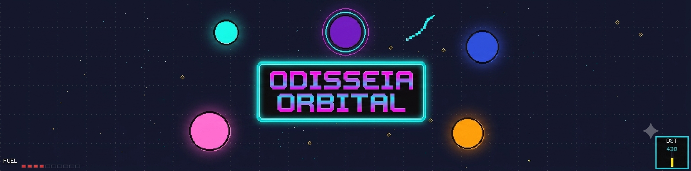

<p align="center">
  
</p>


---

## 🎓 Projeto Academico

<div align="center">

**Universidade Federal do Agreste de Pernambuco (UFAPE)**
Disciplina: **Inteligencia Artificial — 2026.1**
Professor: **Dr. Luis Filipe**

</div>

> 🎯 Este projeto tem como objetivo implementar, analisar e comparar diferentes paradigmas de agentes inteligentes em um ambiente proprio de simulacao orbital com gravidade realista.

### 👥 Equipe

<table align="center">
  <tr>
    <td align="center">
      <a href="https://github.com/alinesors">
        <br>
        <sub><b>Aline Fernanda Soares Silva</b></sub><br>
        <sub>@alinesors</sub>
      </a>
    </td>
    <td align="center">
      <a href="https://github.com/ClaudersonXavier">
        <br>
        <sub><b>Clauderson Branco Xavier</b></sub><br>
        <sub>@ClaudersonXavier</sub>
      </a>
    </td>
  </tr>
</table>

---

## 📑 Navegacao Rapida

| Secao | |
|---|---|
| 📖 [Sobre o Projeto](#-sobre-o-projeto) | 🕹️ [Controles](#%EF%B8%8F-controles) |
| 📋 [Requisitos](#-requisitos) | 📁 [Estrutura](#-estrutura-do-projeto) |
| 🔧 [Instalacao](#-instalacao) | 🧠 [Ambiente](#-ambiente) |
| 🚀 [Como Executar](#-como-executar) | 🤖 [Agentes](#-agentes-implementados) |

---

## 📖 Sobre o Projeto

> **Simulador 2D de navegacao espacial com gravidade realista, fisica orbital e visual pixel art retro.**

Desenvolvido em Python com Pygame e NumPy, voce pilota uma nave por um campo gravitacional com 6 planetas, coleta checkpoints de combustivel e tenta atracar na estacao espacial — tudo com estetica arcade 16-bit dos anos 90.

### ✨ Destaques

> 🌌 **Fisica orbital realista** — 6 planetas com massas distintas gerando campos gravitacionais
> 🎯 **3 paradigmas de IA** — Busca Informada, Computacao Evolutiva e Aprendizado por Reforco
> 🧩 **Interface Gymnasium** — `reset`, `step`, `render`, `close` — pronto para RL
> 🕹️ **Pixel art retro** — Estetica 16-bit com paleta de 16 cores e efeitos neon
> 📊 **Ambiente unificado** — Mesmo cenario e regras para todos os agentes

### 🤖 Agentes Implementados

| | Agente | Paradigma | Abordagem |
|---|---|---|---|
| 🧭 | [**Busca Heuristica (A\*)**](docs/agentes/agente-heuristico.md) | Busca Informada | Grid + A* + Controlador PID |
| 🧬 | [**Algoritmo Genetico**](docs/agentes/agente-genetico.md) | Computacao Evolutiva | Neuroevolucao: RNA 8→16→5 |
| 🧠 | [**Q-Learning Tabular**](docs/agentes/agente-qlearning.md) | Aprendizado por Reforco | 36.720 estados + Reward Shaping |

---

## 📋 Requisitos

| Dependencia | Versao | Uso |
|---|---|---|
|  | `3.8+` | Linguagem base |
|  | `2.5.0+` | Renderizacao, input e janela |
|  | `1.24.0+` | Calculo vetorial e fisica |

```bash
pip install -r requirements.txt
```

---

## 🔧 Instalacao

```bash
# 1. Clone ou extraia os arquivos do repositorio

# 2. (Recomendado) Crie e ative um ambiente virtual
python -m venv venv
venv\Scripts\activate       # Windows
# source venv/bin/activate  # Linux/Mac

# 3. Instale as dependencias
pip install -r requirements.txt
```

---

## 🚀 Como Executar

> 💡 Todos os comandos sao executados a partir da **raiz do projeto**.

### 🎮 Modo Jogador

```bash
python run_game.py
```

Ao iniciar: tela de titulo "ODISSEIA ORBITAL" em neon → pressione **ENTER** → pilote a nave ate a estacao!

### 🤖 Modos com Agentes

| | Agente | Comando rapido | Descricao |
|---|---|---|---|
| 🧭 | [**Heuristico (A\*)**](docs/agentes/agente-heuristico.md) | `python run_heuristic.py` | A* visual ao vivo |
| 🧬 | [**Genetico**](docs/agentes/agente-genetico.md) | `python run_genetic.py` | Debug/treino/showcase |
| 🧠 | [**Q-Learning**](docs/agentes/agente-qlearning.md) | `python run_qlearning.py` | Assiste agente treinado |

#### 🧠 Q-Learning — Subcomandos

| Comando | Descricao |
|---|---|
| `python run_qlearning.py` | 🎮 Modo show — assiste o agente treinado (1 episodio) |
| `python run_qlearning.py --train` | 🏋️ Treino completo — 80.000 episodios headless |
| `python run_qlearning.py --train --eps 40000` | 🔢 Treino com N episodios |
| `python run_qlearning.py --show` | 👁️ Assiste o agente treinado (1 episodio) |
| `python run_qlearning.py --show --episodios 5` | 🎬 Assiste N episodios |
| `python run_qlearning.py --list` | 📋 Lista checkpoints salvos |

> ⚠️ O treino (`--train`) pode levar horas. A tabela Q treinada ja esta incluida em `game-enviroment/agents/q_learning/checkpoints/`.

---

## 🕹️ Controles

| Tecla | Acao |
|---|---|
| **W** `ou` **↑** | Impulso para cima |
| **S** `ou` **↓** | Impulso para baixo |
| **A** `ou` **←** | Impulso para esquerda |
| **D** `ou` **→** | Impulso para direita |
| **R** | Reiniciar o episodio |
| **ESC** | Sair do jogo |

> ⚠️ Cada impulso custa `2.5` de combustivel. Colete checkpoints para reabastecer!

---

## 📁 Estrutura do Projeto

```
odisseia-orbital/
│
├── 🚀 run_game.py                ← Atalho: jogar manualmente
├── 🧭 run_heuristic.py           ← Atalho: agente heuristico
├── 🧬 run_genetic.py             ← Atalho: agente genetico
├── 🧠 run_qlearning.py           ← Atalho: agente Q-Learning
├── 📦 requirements.txt           ← Dependencias
├── 📄 README.md                  ← Este arquivo
│
├── 📁 docs/
│   ├── 📁 agentes/               ← Documentacao detalhada por agente
│   ├── 📁 fotos/                 ← Fotos da equipe
│   └── 📁 plans/                 ← Planejamento dos agentes
│
└── 📁 game-enviroment/
    ├── 🎮 main.py                ← Tela de titulo + jogo manual
    ├── 🌌 orbital_env.py         ← Ambiente Gymnasium (reset/step/render)
    ├── ⚡ physics.py              ← Fisica: gravidade, colisoes, cinematica
    ├── ⚙️ config.py               ← Constantes, cores, recompensas
    │
    └── 📁 agents/
        ├── 📁 heuristic_goal/    ← 🧭 Agente A*
        │   ├── heuristic_agent.py
        │   ├── grid_map.py
        │   ├── astar_planner.py
        │   ├── auto_pilot.py
        │   ├── visualization.py
        │   ├── replay_buffer.py
        │   └── 📁 training_data/
        │
        ├── 📁 genetic/           ← 🧬 Agente Genetico
        │   ├── ship.py           ← NaveGenetica + CerebroNave (RNA)
        │   ├── genetic_env.py    ← AmbienteGenetico
        │   ├── treinador.py      ← TreinadorGenetico
        │   └── 📁 checkpoints/   ← Cerebros salvos (.pkl)
        │
        └── 📁 q_learning/        ← 🧠 Agente Q-Learning
            ├── agent.py          ← AgenteQLearning (ε-greedy + Bellman)
            ├── discretizer.py    ← DiscretizadorEstado (36.720 estados)
            ├── treinador.py      ← Loop de treino + reward shaping
            └── 📁 checkpoints/   ← Tabelas Q salvas (.pkl)
```

---

## 🧠 Ambiente

> O ambiente e **compartilhado** por todos os agentes. Abaixo estao as especificacoes tecnicas comuns.

### 📡 Representacao do Estado

Vetor numpy de **7 elementos** continuos:

| # | Simbolo | Descricao |
|---|---|---|
| 0 | `pos_x` | Posicao horizontal da nave |
| 1 | `pos_y` | Posicao vertical da nave |
| 2 | `vel_x` | Velocidade horizontal |
| 3 | `vel_y` | Velocidade vertical |
| 4 | `fuel` | Combustivel restante (max 200) |
| 5 | `dist_cp` | Distancia ao checkpoint mais proximo |
| 6 | `dist_st` | Distancia ate a estacao |

### 🎮 Espaco de Acoes — `Discrete(5)`

| # | Acao | Efeito |
|---|---|---|
| `0` | ⏸️ Parado | Nenhum impulso (segue inercia) |
| `1` | ⬆️ Cima | Thrust `-0.9` em Y |
| `2` | ⬇️ Baixo | Thrust `+0.9` em Y |
| `3` | ➡️ Direita | Thrust `+0.9` em X |
| `4` | ⬅️ Esquerda | Thrust `-0.9` em X |

> ⚠️ Acoes 1-4 consomem `2.5` de combustivel cada.

### ⚡ Parametros Fisicos

| Constante | Valor | Significado |
|---|---|---|
| `G` | `0.75` | Constante gravitacional |
| `THRUST_POWER` | `0.9` | Forca de aceleracao |
| `MAX_SPEED` | `2.75` | Velocidade maxima (clamp) |
| `MAX_FUEL` | `200.0` | Combustivel maximo |
| `FUEL_PICKUP` | `50.0` | Recarga por checkpoint |
| `FUEL_COST_PER_THRUST` | `2.5` | Custo por impulso |
| `SHIP_RADIUS` | `8` | Raio de colisao da nave |

### 🎯 Funcao de Recompensa

| Evento | Recompensa | Tipo |
|---|---|---|
| ⏱️ Step (cada frame) | `-0.005` | Continuo |
| 🔥 Impulso (thrust) | `-3.5` | Custo |
| 💎 Coletar checkpoint | `+500.0` | Esparso |
| 🏆 Atracar na estacao | `+8000.0` | Esparso |
| 💥 Colisao com planeta | `-1000.0` | Falha |
| 🚫 Sair da tela | `-1000.0` | Falha |
| ⛽ Sem combustivel | `-750.0` | Falha |
| 🎁 Bonus combustivel | `+10 × fuel` | Bonus ao atracar |

### 🛑 Condicoes de Termino

| Status | Condicao |
|---|---|
| 🏆 `docked` | Nave atinge a estacao espacial |
| 💥 `crashed_planet` | Colisao com planeta |
| 🚫 `out_of_bounds` | Fora dos limites 800x600 |
| ⛽ `no_fuel` | Combustivel zerado |
| ⏰ `timeout` | 2000 passos sem conclusao |

---

## 🤖 Agentes Implementados

> 📄 Cada agente possui pagina propria com documentacao completa, diagramas de arquitetura, parametros e guia de execucao.

| | Agente | Abordagem | Como executar |
|---|---|---|---|
| 🧭 | [**Busca Heuristica**](docs/agentes/agente-heuristico.md) | A* + PID | `python run_heuristic.py` |
| 🧬 | [**Algoritmo Genetico**](docs/agentes/agente-genetico.md) | Neuroevolucao | `python run_genetic.py` |
| 🧠 | [**Q-Learning**](docs/agentes/agente-qlearning.md) | Tabela Q tabular | `python run_qlearning.py` |

---

[⬆ Voltar ao topo](#)
