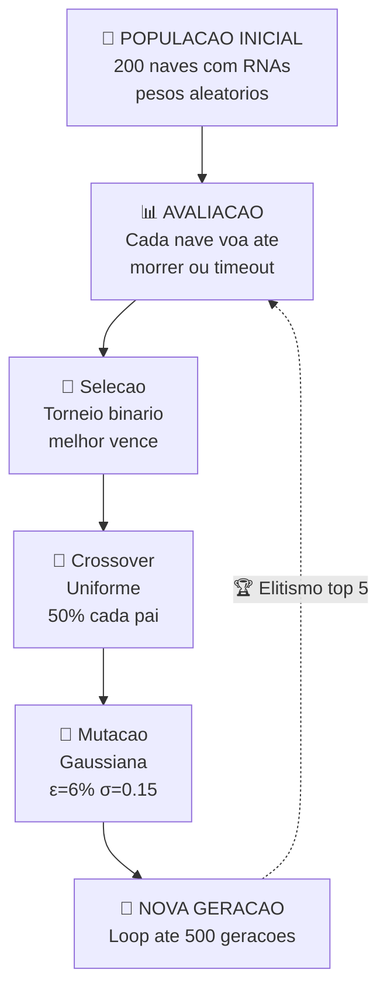
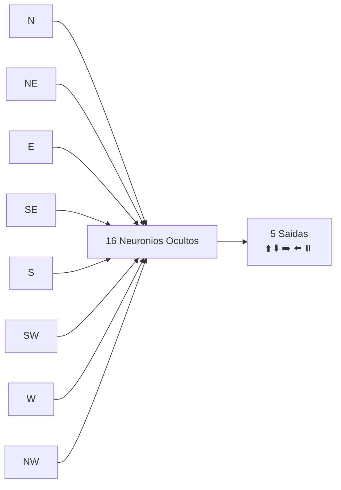

# 🧬 Agente de Algoritmo Genetico (Neuroevolucao)

[🔙 README](../../README.md) &nbsp; | &nbsp; 📋 **Paradigma:** Computacao Evolutiva &nbsp; | &nbsp; 🎯 **Objetivo:** Evoluir RNAs que pilotam naves

---

## 💡 Ideia Central

> Uma populacao de 200 naves cada uma com um cerebro artificial (RNA 8→16→5) compete para sobreviver. As melhores se reproduzem gerando filhos com crossover e mutacao. Nao ha aprendizado individual: a inteligencia emerge da evolucao da populacao.

---

## ⚡ Ciclo Evolutivo



---

## 🚀 Como Executar

| Comando | Descricao |
|---|---|
| `python run_genetic.py` | Debug visual ve a frota evoluindo ao vivo |
| `python run_genetic.py --train` | Treino headless 500 geracoes |
| `python run_genetic.py --train --gens 100` | Treino com N geracoes |
| `python run_genetic.py --train --pop 100` | Treino com N naves por geracao |
| `python run_genetic.py --show` | Showcase do melhor cerebro (best.pkl) |
| `python run_genetic.py --show --gen 20` | Showcase de uma geracao especifica |
| `python run_genetic.py --list` | Lista checkpoints salvos |

> ⚠️ Modo `--train` pode levar varios minutos. Use `--showcase` para ver o progresso visualmente.

---

## 🧩 Componentes

| Arquivo | Papel |
|---|---|
| 🚀 `ship.py` | `NaveGenetica`: nave com 8 sensores + estado | `CerebroNave`: RNA com pesos evolutivos |
| 🌌 `genetic_env.py` | `AmbienteGenetico`: gerencia frota, sensores, fisica e fitness |
| 🧬 `treinador.py` | `TreinadorGenetico`: loop de evolucao, selecao, save/load |

---

## 🏗️ Arquitetura da RNA



Cada sensor lanca um raio na direcao correspondente (N, NE, E, SE, S, SW, W, NW) e retorna a distancia normalizada `[0, 1]` ate o obstaculo ou checkpoint mais proximo.

---

## ⚙️ Funcionamento — Passo a Passo

| # | Etapa | Descricao |
|---|---|---|
| 1 | 🧬 **Inicializacao** | Populacao de N naves com pesos sinapticos aleatorios |
| 2 | 📊 **Avaliacao** | Cada nave voa ate morrer. Fitness = f(cps, proximidade, fuel, colisoes) |
| 3 | 🎯 **Selecao** | Torneio binario: sorteia 2, a melhor vira progenitora |
| 4 | 🧬 **Crossover** | Dois pais geram filho com crossover uniforme (50% cada) |
| 5 | 🧪 **Mutacao** | Perturbacao gaussiana em cada gene: `ε = 6%`, `σ = 0.15` |
| 6 | 🏆 **Elitismo** | Top 5 da geracao anterior sao preservados integralmente |
| 7 | 🔄 **Nova Geracao** | Populacao = filhos + elite. Volta ao passo 2 |

---

## 📊 Parametros da Evolucao

| Parametro | Valor | Significado |
|---|---|---|
| 🧬 Populacao | `200` | Naves por geracao |
| 🔄 Geracoes | `500` | Ciclos evolutivos |
| 🧪 Taxa de mutacao | `0.06` | Prob. de mutacao por gene |
| 💪 Forca de mutacao | `0.15` | Magnitude da perturbacao (`σ`) |
| 📉 Decay de mutacao | `0.9992` | `σ ← σ × 0.9992` por geracao |
| ⏰ Passos maximos | `2000` | Timeout por episodio |

---

## 💾 Checkpoints

```
game-enviroment/agents/genetic/checkpoints/
├── best.pkl          ← Melhor cerebro global
├── gen_0001.pkl      ← Melhor da geracao 1
├── gen_0050.pkl      ← Melhor da geracao 50
└── ...
```

> 💡 O melhor cerebro e sempre salvo como `best.pkl`. Use `--show` para assisti-lo pilotar.

---

[🔙 Voltar ao README](../../README.md)
