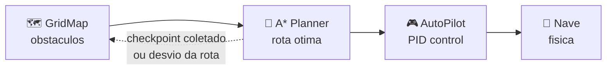

# 🧭 Agente de Busca Heuristica (A*)

[🔙 README](../../README.md) &nbsp; | &nbsp; 📋 **Paradigma:** Busca Informada &nbsp; | &nbsp; 🎯 **Objetivo:** Rota otima ate a estacao

---

## 💡 Ideia Central

> Planejar uma rota livre de colisoes em um grid 2D usando o algoritmo A*, e entao seguir essa rota com um controlador PID que corrige a trajetoria em tempo real.

---

## ⚡ Fluxo de Execucao



---

## 🚀 Como Executar

| Comando | Descricao |
|---|---|
| `python run_heuristic.py` | Executa o agente com visualizacao completa |
| `python run_heuristic.py --trained latest` | Replay da run mais recente |
| `python run_heuristic.py --trained 001` | Replay de uma run especifica |
| `python run_heuristic.py --list` | Lista todas as runs salvas |

---

## 🧩 Componentes

| Arquivo | Papel |
|---|---|
| 🗺️ `grid_map.py` | Converte planetas em grid de ocupacao (celulas livres/bloqueadas) |
| 🎯 `astar_planner.py` | Algoritmo A* com heuristica de distancia euclidiana |
| 🎮 `auto_pilot.py` | Controlador PID: corrige direcao e velocidade da nave |
| 🧠 `heuristic_agent.py` | Orquestrador: coordena planejamento → execucao → replanejamento |
| 💾 `replay_buffer.py` | Serializa/deserializa runs para reproducao posterior |
| 👁️ `visualization.py` | Renderiza grid, rota planejada e estado do agente |

---

## ⚙️ Funcionamento

### Passo 1 : 🗺️ Mapeamento
Os 6 planetas sao projetados como obstaculos circulares no grid. O espaco livre vira celulas navegaveis.

### Passo 2 : 🎯 Planejamento A*
O A* encontra a rota mais curta do checkpoint mais proximo ate a nave, desviando das zonas de colisao. A heuristica e a **distancia euclidiana** ate o destino.

```
f(n) = g(n) + h(n)

g(n) = custo acumulado do inicio ate o no n
h(n) = distancia euclidiana de n ate o destino (heuristica admissivel)
```

### Passo 3 : 🎮 AutoPilot (PID)
O controlador **Proporcional-Derivativo** compara a posicao/velocidade atual da nave com o waypoint mais proximo da rota e aplica impulsos corretivos.

### Passo 4 : 🔄 Replanejamento
Se a nave se desviar alem do toleravel ou coletar um checkpoint, o ciclo reinicia: novo grid → novo A* → novo PID.

---

## 💾 Dados de Treino

```
game-enviroment/agents/heuristic_goal/training_data/
├── run_001.pkl
├── run_002.pkl
└── ...
```

> 💡 Runs sao salvas automaticamente. Use `--trained` para reproduzir qualquer uma depois.

---

[🔙 Voltar ao README](../../README.md)
