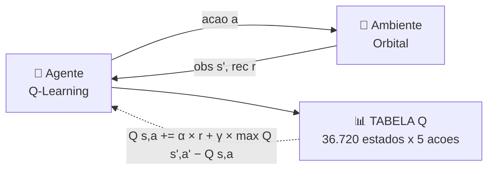
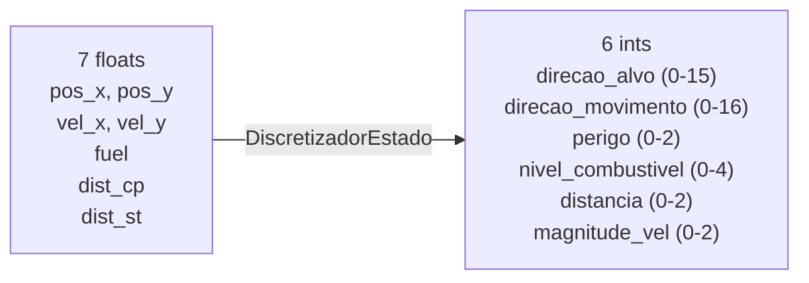
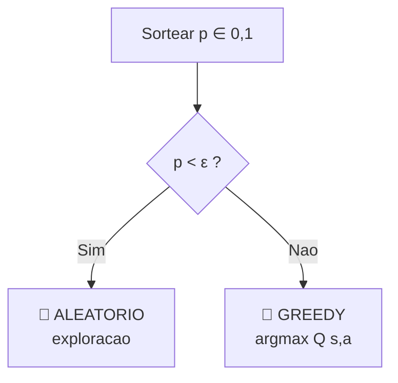

# 🧠 Agente Q-Learning Tabular (Aprendizado por Reforco)

[🔙 README](../../README.md) &nbsp; | &nbsp; 📋 **Paradigma:** Aprendizado por Reforco &nbsp; | &nbsp; 🎯 **Objetivo:** Aprender politica otima via tentativa e erro

---

## 💡 Ideia Central

> O agente aprende por tentativa e erro, atualizando uma tabela Q com 36.720 estados discretizados. A cada acao, recebe recompensa ou penalidade do ambiente. Com 80.000 episodios de treino, a tabela converge para a politica otima.

---

## ⚡ Loop de Aprendizado



---

## 🚀 Como Executar

| Comando | Descricao |
|---|---|
| `python run_qlearning.py --train` | Treino completo — 80.000 episodios headless |
| `python run_qlearning.py --train --eps N` | Treino com N episodios |
| `python run_qlearning.py --watch` | Assiste o agente treinado (1 episodio) |
| `python run_qlearning.py --watch --episodios 5` | Assiste N episodios |
| `python run_qlearning.py --list` | Lista checkpoints salvos |

> ⚠️ O treino pode levar horas. A tabela Q treinada ja esta incluida em `game-enviroment/agents/q_learning/checkpoints/`.
> 💡 A cada 5.000 episodios, o treino exibe um showcase visual para acompanhar o progresso.

---

## 🧩 Componentes

| Arquivo | Papel |
|---|---|
| 🚀 `run_qlearning.py` | Entrada unificada: treino, watch e listagem de checkpoints |
| 🎯 `agents/q_learning/treinador.py` | Loop de treino: 80k episodios + showcases periodicos + reward shaping |
| 🧠 `agents/q_learning/agent.py` | `AgenteQLearning`: politica ε-greedy, Bellman, persistencia |
| 📐 `agents/q_learning/discretizer.py` | `DiscretizadorEstado`: 7D continuo → 6D discreto (36.720 estados) |
| 💾 `agents/q_learning/checkpoints/` | Tabelas Q treinadas (dicionario esparso serializado) |

---

## 🧮 Equacao de Bellman

```
Q(S, A)  ←  Q(S, A)  +  α  ×  [  R  +  γ × max Q(S', a)  −  Q(S, A)  ]
   ↑            ↑         ↑        ↑        ↑     ↑            ↑
 novo        antigo     taxa     recomp.  desconto  futuro      erro TD
Q-value     Q-value    aprend.  imediata    (γ)    estimado
```

| Simbolo | Significado | Valor |
|---|---|---|
| **α** (alpha) | Taxa de aprendizado — confianca em novas experiencias | `0.05` |
| **γ** (gamma) | Fator de desconto — valorizacao do futuro | `0.97` |
| **R** | Recompensa imediata do ambiente | variavel |
| **S** | Estado atual (tupla de 6 ints) | — |
| **A** | Acao executada (0 a 4) | — |
| **S'** | Proximo estado | — |

---

## 📐 Discretizador (Bussola Dinamica)

> O espaco continuo de **7 dimensoes** e reduzido para **6 inteiros** = **36.720 estados possiveis**.


```
Total: 16×17×3×5×3×3 = 36.720 estados
```

### Detalhamento das Dimensoes

| Dimensao | Faixa | Criterio |
|---|---|---|
| 🧭 `direcao_alvo` | `0-15` | 16 setores de 22.5° — direcao do alvo atual |
| 🏃 `direcao_mov` | `0-16` | 16 setores + 1 "parado" (`vel < 0.1`) |
| ⚠️ `perigo` | `0-2` | `0`=seguro, `1`=alerta (`<80px`), `2`=perigo (`<40px`) |
| ⛽ `nivel_comb` | `0-4` | `0`=critico (`<40`), `1`=baixo (`<80`), `2`=medio (`<120`), `3`=alto (`<160`), `4`=cheio |
| 📏 `distancia` | `0-2` | `0`=perto (`<80px`), `1`=medio (`<200px`), `2`=longe |
| 💨 `magnitude_vel` | `0-2` | `0`=lento (`<0.8`), `1`=moderado (`<1.8`), `2`=rapido |

### 🧭 Bussola Dinamica

O alvo e **sempre** o checkpoint nao coletado mais proximo. Quando todos sao coletados, o alvo vira a estacao espacial.

> 💡 Isso cria um comportamento natural de varredura: o agente e guiado sequencialmente pelos checkpoints ate o objetivo final.

---

## 🎯 Politica ε-greedy


```
ε decai a cada episodio: ε ← max(ε × 0.99996, 0.03)
```

---

## 📊 Hiperparametros

| Parametro | Valor | Significado |
|---|---|---|
| **α** (alpha) | `0.05` | Taxa de aprendizado |
| **γ** (gamma) | `0.97` | Fator de desconto (valoriza futuro) |
| **ε** inicial | `1.0` | 100% exploracao no inicio |
| **ε** minimo | `0.03` | 3% de exploracao minima |
| **ε** decay | `0.99996` | Decaimento exponencial por episodio |
| 🎯 Valor otimista | `5.0` | Q-values iniciais (incentiva exploracao) |
| 🔄 Episodios | `80.000` | Total de episodios de treino |
| ⏰ MAX\_PASSOS | `2.000` | Passos maximos por episodio |

---

## 🎁 Reward Shaping

> Alem das recompensas do ambiente, o agente recebe um **bonus de aproximacao**:

```
bonus = (dist_antiga − dist_nova) × 2.0
```

Se a nave se aproximou do alvo → bonus positivo. Se se afastou → bonus negativo. Isso acelera o aprendizado em um ambiente com recompensas naturalmente esparsas.

---

## 🚀 Inicializacao Otimista

> Todos os Q-values comecam em `5.0` em vez de `0.0`.

O agente assume que **toda acao desconhecida e boa** ate provar o contrario. Isso o incentiva a experimentar estados novos. Acoes que levam a colisoes (`-1000`) tem o Q-value rapidamente reduzido. Acoes que levam a checkpoints (`+500`) mantem o Q-value alto.

---

[🔙 Voltar ao README](../../README.md)
